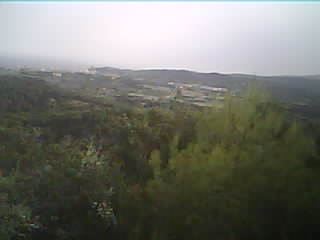

# BStation: LoRa Image Transmission and Base Station  📡

This project implements a system for capturing images and sensor data using an ESP32-CAM-based LoRa-enabled base station (`BStation`), transmitting this data over LoRa, and receiving and processing the data on a central server (`app.py`). It also includes a LoRa receiver (`BReceiver`) that can forward messages to a serial port, useful for debugging or as an intermediary. The system is designed for remote image capture and data acquisition in scenarios where direct network connectivity is limited.

## 🚀 Key Features

*   **Image Capture and Transmission:** The `BStation` captures images using the ESP32-CAM and transmits them over LoRa in fragmented packets.
*   **Sensor Data Acquisition:** The `BStation` can potentially read data from connected sensors (e.g., temperature, humidity) and transmit it along with the images.
*   **LoRa Communication:** Utilizes LoRa for long-range, low-power wireless communication between the `BStation`, `BReceiver`, and the central server.
*   **Image Reconstruction:** The `app.py` script reconstructs the transmitted image from the received packets.
*   **Command Handling:** The system supports sending commands to the `BStation` to control its behavior (e.g., change image resolution, trigger image capture).
*   **Configuration Persistence:** The `BStation` stores configuration parameters in RTC memory to preserve them across deep sleep cycles.
*   **Serial Bridging:** The `BReceiver` forwards LoRa messages to the serial port and vice versa, facilitating debugging and indirect communication.
*   **Error Handling:** Includes error handling for serial communication, LoRa transmission, and image reconstruction.
*   **Image Saving:** The `app.py` script saves the reconstructed image to a file with a timestamped filename.

## 🛠️ Tech Stack

*   **BStation (ESP32-CAM):**
    *   Arduino IDE
    *   ESP32-CAM module
    *   LoRa module
    *   C++
    *   `LoRa.h`
    *   `SPI.h`
    *   `DHT.h` (potentially)
    *   `WiFi.h` (disabled)
    *   `esp_camera.h`
    *   `esp_wifi.h` (disabled)
    *   `esp_bt.h` (disabled)
    *   `<vector>`
    *   `CRC8.h`
    *   `camera_pins.h`
*   **BReceiver (Arduino):**
    *   Arduino IDE
    *   LoRa module
    *   C++
    *   `SPI.h`
    *   `LoRa.h`
*   **app.py (Server):**
    *   Python 3.x
    *   `serial`
    *   `threading`
    *   `time`
    *   `re`
    *   `sys`
    *   `os`
    *   `datetime`

## 📦 Getting Started / Setup Instructions

### Prerequisites

*   **Arduino IDE:** Required for programming the ESP32-CAM and the LoRa receiver.
    *   Install the ESP32 board support in the Arduino IDE.
    *   Install the required libraries (LoRa, SPI, DHT - if used, etc.) through the Arduino Library Manager.
*   **Python 3.x:** Required for running the `app.py` script.
*   **Python Libraries:** Install the necessary Python libraries using pip:

    ```bash
    pip install pyserial
    ```

### Installation

1.  **BStation (ESP32-CAM):**
    *   Connect the ESP32-CAM to your computer using a USB-to-serial adapter.
    *   Open the `BStation/BStation.ino` sketch in the Arduino IDE.
    *   Configure the correct board and port in the Arduino IDE.
    *   Modify the LoRa parameters (frequency, etc.) in the sketch to match your LoRa module.
    *   Upload the sketch to the ESP32-CAM.
2.  **BReceiver (Arduino):**
    *   Connect the Arduino to your computer.
    *   Open the `BReceiver/BReceiver.ino` sketch in the Arduino IDE.
    *   Configure the correct board and port in the Arduino IDE.
    *   Modify the LoRa parameters (frequency, etc.) in the sketch to match your LoRa module.
    *   Upload the sketch to the Arduino.
3.  **app.py (Server):**
    *   Clone the repository to your local machine.
    *   Navigate to the directory containing the `app.py` script.
    *   Install the required Python libraries (see Prerequisites).

### Running Locally

1.  **BReceiver (Optional):**
    *   Connect the `BReceiver` to your computer via USB.
    *   Open the Serial Monitor in the Arduino IDE to view the received LoRa messages.
2.  **app.py (Server):**
    *   Identify the serial port connected to either the `BStation` directly or the `BReceiver`.
    *   Open a terminal or command prompt.
    *   Navigate to the directory containing the `app.py` script.
    *   Run the script using the following command, replacing `/dev/ttyUSB0` with the correct serial port:

    ```bash
    python app.py -p /dev/ttyUSB0 -b 115200
    ```

    *   **Note:** You may need to adjust the baud rate (`-b`) to match the configuration of your serial connection.
    *   If you are using Windows, the port will likely be something like `COM3`.

## 💻 Usage

1.  Power on the `BStation`. It will start capturing images and transmitting them over LoRa.
2.  The `BReceiver` (if used) will receive the LoRa messages and forward them to the serial port.
3.  The `app.py` script will listen for incoming data from the serial port, reconstruct the images, and save them to the local file system.
4.  You can send commands to the `BStation` via the serial port (either directly or through the `BReceiver`). The `app.py` script can be modified to send these commands.

## 📂 Project Structure

```
├── app.py                  # Main Python script for receiving and processing data
├── BStation/              # Arduino sketch for the ESP32-CAM base station
│   └── BStation.ino
│   └── camera_pins.h       # Pin definitions for the ESP32-CAM camera
├── BReceiver/             # Arduino sketch for the LoRa receiver
│   └── BReceiver.ino
├── README.md               # This file
```

## 📸 Screenshots




## 🤝 Contributing

Contributions are welcome! Please feel free to submit pull requests or open issues to suggest improvements or report bugs.

## 📝 License

This project is licensed under the [MIT License](LICENSE).

## 📬 Contact

If you have any questions or suggestions, please feel free to contact me at [bruno08rodriguez@gmail.com](bruno08rodriguez@gmail.com).

## 💖 Thanks Message

Thank you for checking out this project! I hope it's helpful for your LoRa-based image transmission needs.
